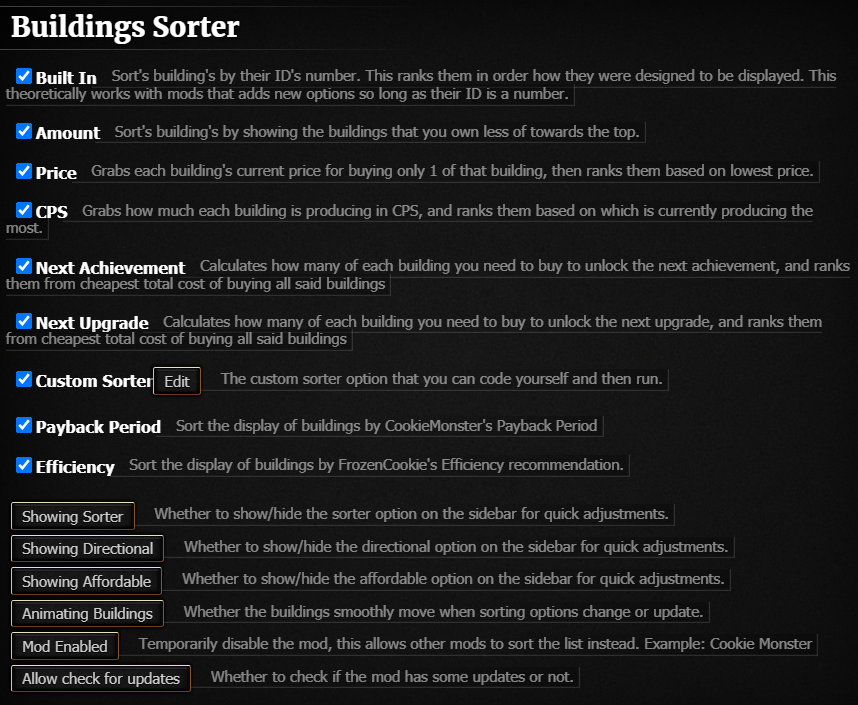

# Building Sorter
This is a mod that sorts the buildings on the right hand side in several different ways. The current list of sorting options are as followed:
 * <b>Built In: </b>Sort's building's by their ID's number. This ranks them in order how they were designed to be displayed. This theoretically works with mods that adds new options so long as their <i>ID</i> is a number.
 * <b>Price: </b>Grabs each building's current price for buying only 1 of that building, then ranks them based on lowest price.
 * <b>CPS: </b>Grabs how much each building is producing in CPS, and ranks them based on which is currently producing the most.
 * <b>Next Achievement: </b>Calculates how many of each building you need to buy to unlock the next <i>achievement</i>, and ranks them from cheapest total cost of buying all said buildings
 * <b>Next Upgrade: </b>Calculates how many of each building you need to buy to unlock the next <i>upgrade</i>, and ranks them from cheapest total cost of buying all said buildings
 * <b>Custom Sorter: </b>For you to create your OWN sorter functionality. If you can come with any new sorting algorithms let me know, I might just add it into the official source code(crediting you of course)
 * <b>CookieMonster's Payback Period: </b>When using the mod CookieMonster, it has it's own sorting functionality that I had overridden. With this you can re-enable it and sort by the mod's Payback Period.
 * <b>FrozenCookie's Efficiency: </b>When using the mod FrozenCookies, it has it's recommendation of what buildings to buy in what order. I have now included a sorter to show the user this change.
This information also is included in the Settings tab of CookieClicker with several options included as well.



## To Install:

### Bookmarklet

Copy this code and save it as a bookmark. Paste it in the URL section. To activate, click the bookmark when the game's open.

```javascript
javascript: (function () {
  Game.LoadMod('https://frustrated-programmer.github.io/BuildingSorter/BuildingSorter.js');
}());
```

If (for some reason) the above doesn't work, trying pasting everything after the <code>javascript:</code> bit into your browser's console.

### Userscript

If you'd rather use the addon as a [userscript](https://en.wikipedia.org/wiki/Userscript) to automatically load _Building Sorter_ every time the original game loads, install the `BuldingSorter.user.js` file. You can do this by clicking on the file in the file-list and clicking "raw".

### Steam

I don't OWN the Steam version, so I've just worked with the documentation. This should work with Steam version but I cannot test it myself. Let me know :D
1. Download the `steam-mod` folder included in this repo.
2. Move the folders of the mods you want into `<yoursteaminstall>\SteamApps\common\Cookie Clicker\resources\app\mods\local`, you can get to this from the mods menu.
3. Enable them in-game with the mods menu.

## Files:
 * `BuildingSorter.js` is the source code, you'll want to load this file using your userscript.
 * `BuildingSorter.main.js` is everything you need if you want to have the source code instead of loading the mod.
 * `BuildingSorter.user.js` is the recommended userscript you can use to load Building Sorter and keep it up to date..
## Credits:
Huge thanks to [CookieMonster](https://github.com/CookieMonsterTeam/CookieMonster), I learned a ton from their code, and I also borrowed a ton of their README.
 
